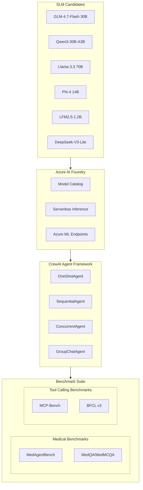

# SLM Agentic Benchmarking Framework

Extend the existing CrewAI-based agent framework from [cs120_paper](file:///Users/samih/offline-documents/cs120_paper) to benchmark SOTA SLMs on medical and agentic tasks, migrating from GCP Vertex AI to Azure.

---

## Architecture Overview



---

## 1. Model Selection

### SOTA Baseline (Non-Agentic)

For direct comparison, run benchmarks with a frontier model in single-turn mode (no agent scaffolding):

| Baseline Model | Purpose | Azure Availability | Est. Cost/1M tokens |
|----------------|---------|-------------------|---------------------|
| **GPT-4o** | SOTA frontier baseline | Azure OpenAI (serverless) | $2.50 in / $10.00 out |
| **GPT-4o-mini** | Cost-efficient SOTA | Azure OpenAI (serverless) | $0.15 in / $0.60 out |

These are **pre-deployed on Azure OpenAI** - no spin-up required, just API calls.

### SLM Candidates (Agentic Testing)

| Model | Size | Azure Availability | Est. Cost/1M tokens |
|-------|------|-------------------|---------------------|
| **Phi-4** | 14B | Azure AI Foundry (serverless) | $0.07 in / $0.14 out |
| **Llama 3.3 70B** | 70B | Azure AI Foundry (serverless) | $0.27 in / $0.27 out |
| **Mistral Small 3.1** | 24B | Azure AI Foundry (serverless) | $0.10 in / $0.30 out |
| **GLM-4.7-Flash** | 30B MoE | Azure ML (deploy from HF) | ~$0.05-0.10 in/out |
| **Qwen3-30B-A3B** | 30B MoE | Azure ML (deploy from HF) | ~$0.05-0.10 in/out |
| **LFM2.5-1.2B** | 1.2B | Azure ML (deploy from HF) | ~$0.01-0.02 in/out |

**Serverless models (Phi-4, Llama, Mistral)** = Pay-per-token, no infrastructure costs

**Azure ML deployments (GLM, Qwen, LFM)** = Requires managed endpoint (~$0.50-2/hr)

---

## 2. Benchmark Suite

### Medical Benchmarks (Domain Expertise)

**Primary: MedAgentBench** (recommended over traditional MCQAs)

- 100 clinically-derived agentic tasks
- FHIR-compliant interactive environment
- Tests actual agent capabilities, not just knowledge
- GitHub: `stanfordmlgroup/MedAgentBench`

**Secondary: Traditional Medical QA**

- MedQA (USMLE-style questions)
- MedMCQA (Indian medical MCQs)
- PubMedQA (biomedical literature)

### Tool Calling Benchmarks (Agentic Skills)

**Primary: MCP-Bench**

- 250+ tools across 28 MCP servers
- Multi-hop planning, parameter precision
- Cross-domain coordination
- GitHub: Available via arXiv 2508.20453

**Secondary: BFCL v3** (Berkeley Function Calling Leaderboard)

- Standard function calling evaluation
- Simple/parallel/nested tool calls
- Well-established baseline

---

## 3. Framework Adaptation

### Azure LLM Configuration

Replace `src/config/llm_config.py` with Azure-compatible configuration:

```python
# Key changes from GCP to Azure
AZURE_MODELS = {
    "phi-4": {
        "model": "azure/phi-4",
        "deployment": "phi-4-serverless",
    },
    "llama-3.3-70b": {
        "model": "azure/Meta-Llama-3.3-70B-Instruct", 
        "deployment": "llama-3-3-70b-serverless",
    },
    # HuggingFace models via Azure ML endpoints
    "glm-4.7-flash": {
        "model": "azure_ml/glm-4-7-flash",
        "endpoint_url": "${AZURE_ML_ENDPOINT}",
    },
}
```

### Benchmark Runner Structure

```
slm-agentic-benchmarking/
├── src/
│   ├── agents/           # Reuse from cs120_paper
│   │   ├── base_agent.py
│   │   ├── one_shot_agent.py
│   │   ├── sequential_agent.py
│   │   ├── concurrent_agent.py
│   │   └── group_chat_agent.py
│   ├── config/
│   │   └── azure_llm_config.py   # NEW: Azure configuration
│   ├── benchmarks/
│   │   ├── medical/
│   │   │   ├── medagent_bench.py
│   │   │   └── medqa_runner.py
│   │   └── tool_calling/
│   │       ├── mcp_bench.py
│   │       └── bfcl_runner.py
│   └── evaluation/
│       └── metrics.py
├── run_benchmark.py        # Main entry point
├── pyproject.toml
└── results/
```

---

## 4. Azure Deployment Strategy

**Option A: Azure AI Foundry (Recommended)**

- Use Model Catalog for Phi-4, Llama, Qwen
- Serverless inference endpoints (pay-per-token)
- No infrastructure management

**Option B: Azure ML Managed Endpoints**

- Deploy HuggingFace models (GLM, LFM, DeepSeek)
- Requires endpoint provisioning
- More control, higher fixed costs

**Setup Requirements:**

```bash
# Azure CLI setup
az login
az account set --subscription "your-startup-subscription"

# Environment variables
export AZURE_OPENAI_API_KEY="..."
export AZURE_OPENAI_ENDPOINT="https://your-resource.openai.azure.com"
export AZURE_ML_ENDPOINT="https://your-ml-endpoint.inference.ml.azure.com"
```

---

## 5. Key Implementation Tasks

### Phase 1: Framework Migration

- Port `llm_config.py` to Azure (LiteLLM supports Azure natively)
- Copy agent architectures from cs120_paper
- Add Azure authentication/credentials handling

### Phase 2: Benchmark Integration

- Integrate MedAgentBench (clone + adapt runner)
- Add MCP-Bench tool calling evaluation
- Implement BFCL baseline tests

### Phase 3: Experiment Execution

- Run all 6 SLMs x 4 agent types x 2 benchmark categories
- Collect metrics: success rate, latency, cost, refusal patterns
- Compare single-turn vs agentic performance gaps

---

## 6. Cost Breakdown (<$10k Budget)

### Estimated Token Usage Per Benchmark

| Benchmark | Tasks | Avg Tokens/Task | Total Tokens (per model) |
|-----------|-------|-----------------|--------------------------|
| MedAgentBench | 100 | ~8K (multi-turn) | ~800K |
| MedQA | 1,273 | ~500 | ~636K |
| MCP-Bench | 250 | ~4K (tool calls) | ~1M |
| BFCL v3 | 2,000 | ~1K | ~2M |
| **Total per model** | | | **~4.4M tokens** |

### Full Experiment Cost Estimate

**Scenario: 7 models x 5 configurations (4 agent types + non-agentic baseline)**

| Model Type | Token Cost | # Configs | Subtotal |
|------------|-----------|----------|----------|
| GPT-4o baseline (non-agentic only) | ~$55/run | 1 | **$55** |
| GPT-4o-mini baseline | ~$5/run | 1 | **$5** |
| Phi-4 (serverless) | ~$1/run | 5 | **$5** |
| Llama 3.3 70B (serverless) | ~$2.40/run | 5 | **$12** |
| Mistral Small 3.1 (serverless) | ~$1.75/run | 5 | **$9** |
| Azure ML endpoints (GLM/Qwen/LFM) | ~$2/hr x 20hrs | 3 | **$120** |
| **Infrastructure buffer** | | | **$100** |
| **Estimated Total** | | | **~$300-500** |

**You have significant budget headroom** - full experiments should cost under $1,000, leaving room for iterations.

### Budget Safety Plan

```
Budget Allocation ($10,000):
├── Development/Testing:     $500  (dry runs, debugging)
├── Main Experiments:      $2,000  (full benchmark suite)
├── Ablations/Reruns:      $1,500  (follow-up experiments)
├── Azure ML Endpoints:    $1,000  (custom model hosting)
├── Buffer:                $5,000  (unexpected costs, scale-up)
└── TOTAL:                $10,000
```

### Cost Tracking Module

```python
# src/evaluation/cost_tracker.py
class CostTracker:
    PRICING_PER_1M = {  # USD per 1M tokens
        "gpt-4o": {"input": 2.50, "output": 10.00},
        "gpt-4o-mini": {"input": 0.15, "output": 0.60},
        "phi-4": {"input": 0.07, "output": 0.14},
        "llama-3.3-70b": {"input": 0.27, "output": 0.27},
        "mistral-small-3.1": {"input": 0.10, "output": 0.30},
    }
    
    def __init__(self, budget_limit: float = 10000.0):
        self.budget_limit = budget_limit
        self.spent = 0.0
        self.alerts_at = [0.3, 0.6, 0.9]  # 30%, 60%, 90%
    
    def estimate_before_run(self, model, tasks, avg_tokens):
        """Show cost estimate BEFORE running"""
        
    def log_and_check(self, model, input_tokens, output_tokens):
        """Track spending, alert if approaching limit"""
```

### Azure Budget Alerts Setup

```bash
# Set budget alerts at $3k, $6k, $9k thresholds
az consumption budget create \
  --budget-name "slm-benchmark" \
  --amount 10000 \
  --time-grain Monthly \
  --category Cost
```

---

## 7. Quick Start Commands

```bash
# Estimate costs before running (no API calls)
python run_benchmark.py --estimate --models all --benchmark all

# Run non-agentic SOTA baseline
python run_benchmark.py --model gpt-4o-mini --agent none --benchmark medqa

# Run SLM with specific agent architecture
python run_benchmark.py --model phi-4 --agent sequential --benchmark medagent

# Full comparison: agentic vs non-agentic
python run_benchmark.py --model phi-4 --compare-baseline --benchmark all

# Run with hard budget cap
python run_benchmark.py --model all --agent all --max-spend 500
```
